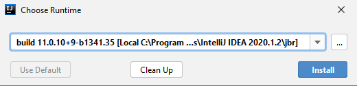
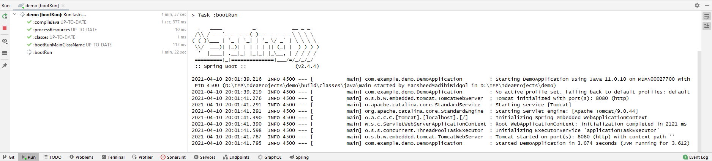
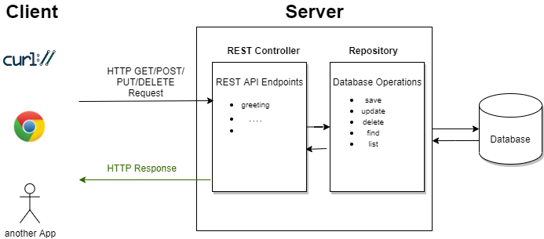

= "Hello World" in Spring Boot
Farsheed Madihi

In order to run a simple web application in Spring Boot, the following tools and minimal knowledge
about them are recommended:

== Prerequisites

* IDE (Integrated Development Environment). I will use JetBrains IntelliJ for this demo.

* JDK (Java Development Kit), which includes JRE (java runtime environment). It is the tool to run and
compile and run java applications. You need to download that and let your IDE have an access to it or, you'd better
use "choose runtime" plugin.

* Asciidoc, to do the documentations.

* git tool to be able to pull this project.

=== IntelliJ
You need to https://www.jetbrains.com/idea/download/#section=windows[download] IntelliJ Community Edition if you don't already have it.

=== JDK
Java Development Kit consists of tools to implement, test, run and package your java program. In IntelliJ, you can download
plugins. Press `ctrl + shift + a` and type "plugins". Please install "choose runtime" from the "marketplace".

After that, again press `ctrl + shift + a` and type "choose runtime" to download JDK.

.choose the shown item in the list and download it

=== git
Download from IntelliJ Plugins the "git" tool. Make sure the plugin is installed by writing this in the Terminal:
`git version`. This should show you the version of the git which is downloaded in your computer. After that, you can
clone (download) this project in your computer using this command:

`git clone https://github.com/FarsheedM/spring-boot-demo.git`

This command make a copy of the project in your local computer. Now you can run this project by yourself locally.

=== AsciiDoc
This tool is used to do the documentations for the different parts of yout application. You can commit your documentations along side
with your code. Just install the "AsciiDoc" plugin from IntelliJ plugin marketplace. (`ctrl + shift + a` and then type plungins to download a plugin)

== Run the program

We use Gradle in order to build this project. Gradle is responsible to get the dependencies needed to run this project e.g.

* spring-boot-starter-web

* spring-boot-starter-test

In order to run this program just press `shift + F10`. (There are many ways of running a program in IntelliJ)

You should see that the program runs in the run tab with the similar logs:

Now if you send a request from your browser to this app, you should see the "Hallo Welt" response.

Just type `localhost:8080/greeting` in your browser to see the response.

== Program's workflow

But how this really works under the hood?

This application is based on the REST-API architecture. In short, we could understand it as
a serie of stateless HTTP request and response to the app/server and back to the client as
illustrated below:

== References

1. IntelliJ: https://www.jetbrains.com/idea/download/#section=windows

2. Git: https://git-scm.com/

3. Learn Spring Boot: https://www.baeldung.com/spring-boot

4. AsciiDoc: https://docs.asciidoctor.org/asciidoc/latest/syntax-quick-reference/